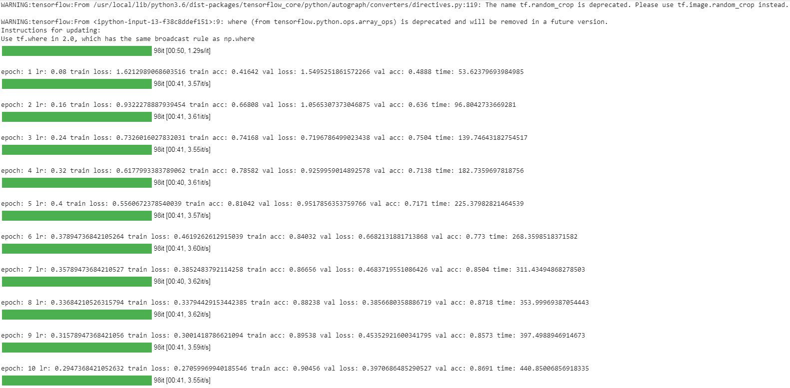
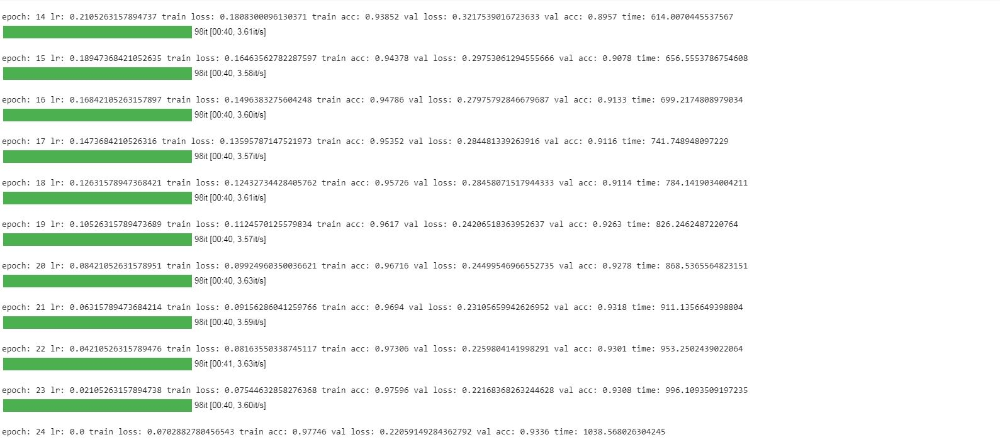
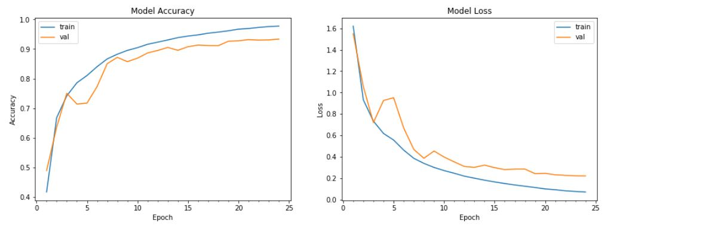

# EVA-Track3-Session14
This repository contains assignment files of TSAI-EVA-Track3 course's session14.

## Group Members

Atul Gupta (samatul@gmail.com)

Gaurav Patel (gaurav4664@gmail.com)

Ashutosh Panda (ashusai.panda@gmail.com)

## Files

**Assignment14.ipynb**

In this assignment  [code](https://colab.research.google.com/drive/16T4C-t148ZRpLz2MiNBZ0eYyGPLNN2Sx) for training DavidNet on Cifar10 dataset has been modified to include cutout and consume data as tfrecords.
We are able to achieve 93.36% validation accuracy in 24 Epochs and 1038 seconds. Training log, accuracy and loss plots are shown below.

 <b>Training logs</b> 

 <b>Training graphs (including validation) and final accuracy</b> 

